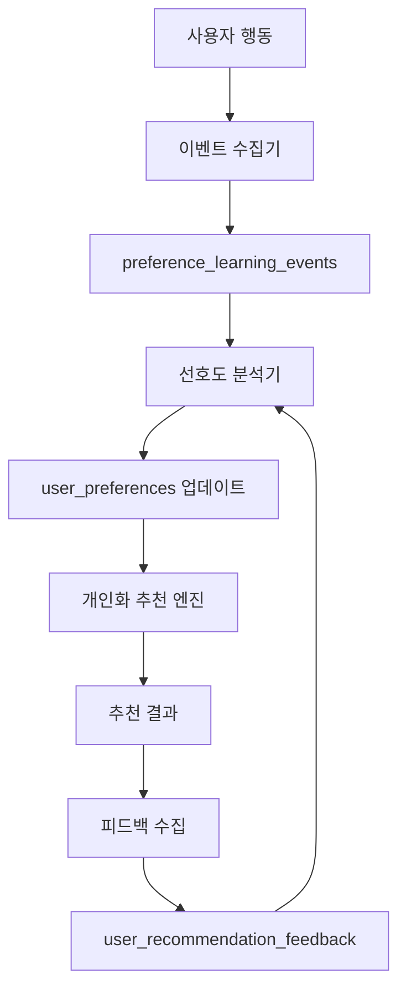

# 사용자 선호도 학습 시스템 - 설계 문서

## 개요

코스모스 플랫폼의 기존 추천 시스템을 확장하여 사용자의 행동 패턴과 선호도를 학습하는 개인화 추천 시스템을 구축합니다. 기존의 `getAdvancedRecommendations` 함수에 사용자 선호도 가중치를 적용하고, 사용자 행동 데이터를 수집/분석하여 점진적으로 추천 정확도를 향상시킵니다.

## 아키텍처

### 시스템 구성 요소



### 데이터 흐름

1. **이벤트 수집**: 사용자의 클릭, 체류시간, 피드백 등을 실시간으로 수집
2. **선호도 분석**: 수집된 이벤트를 분석하여 사용자 선호도 점수 계산
3. **추천 개인화**: 기존 추천 알고리즘에 개인화 가중치 적용
4. **피드백 학습**: 추천 결과에 대한 사용자 피드백을 통해 선호도 재조정

## 컴포넌트 및 인터페이스

### 1. 이벤트 수집 시스템

#### PreferenceLearningTracker
```typescript
interface UserBehaviorEvent {
  userId: string
  eventType: 'click' | 'view' | 'dwell' | 'search' | 'feedback'
  targetType: 'place' | 'category' | 'region' | 'tag'
  targetId: string
  metadata?: {
    dwellTime?: number
    searchQuery?: string
    feedbackType?: 'like' | 'dislike'
    context?: Record<string, any>
  }
}

class PreferenceLearningTracker {
  trackEvent(event: UserBehaviorEvent): Promise<void>
  trackPlaceView(userId: string, placeId: string, dwellTime: number): Promise<void>
  trackSearchQuery(userId: string, query: string, results: Place[]): Promise<void>
  trackRecommendationFeedback(userId: string, placeId: string, feedback: 'like' | 'dislike'): Promise<void>
}
```

#### 클라이언트 사이드 훅
```typescript
interface UsePreferenceLearningReturn {
  trackPlaceView: (placeId: string) => void
  trackPlaceClick: (placeId: string) => void
  trackSearchQuery: (query: string) => void
  trackRecommendationFeedback: (placeId: string, feedback: 'like' | 'dislike') => void
  startDwellTimeTracking: (placeId: string) => () => void
}

function usePreferenceLearning(): UsePreferenceLearningReturn
```

### 2. 선호도 분석 엔진

#### PreferenceAnalyzer
```typescript
interface UserPreferenceProfile {
  userId: string
  categoryPreferences: Record<string, number> // 카테고리별 선호도 점수 (-1 ~ 1)
  priceRangePreferences: Record<number, number> // 가격대별 선호도 점수
  regionPreferences: Record<string, number> // 지역별 선호도 점수
  tagPreferences: Record<string, number> // 태그별 선호도 점수
  searchPatterns: string[] // 자주 사용하는 검색어
  lastUpdated: Date
  confidenceScore: number // 학습 데이터의 신뢰도 (0 ~ 1)
}

class PreferenceAnalyzer {
  analyzeUserEvents(userId: string): Promise<UserPreferenceProfile>
  updatePreferencesFromFeedback(userId: string, placeId: string, feedback: 'like' | 'dislike'): Promise<void>
  calculatePreferenceScores(events: PreferenceLearningEvent[]): UserPreferenceProfile
  decayOldPreferences(userId: string): Promise<void>
}
```

### 3. 개인화 추천 시스템

#### PersonalizedRecommendationEngine
```typescript
interface PersonalizationWeights {
  categoryBoost: number // 최대 20점
  priceRangeBoost: number // 최대 15점
  regionBoost: number // 최대 10점
  tagBoost: number // 최대 10점
}

class PersonalizedRecommendationEngine {
  applyPersonalization(
    places: PlaceScore[], 
    userPreferences: UserPreferenceProfile
  ): PlaceScore[]
  
  calculatePersonalizationScore(
    place: Place, 
    preferences: UserPreferenceProfile
  ): PersonalizationWeights
  
  getPersonalizedRecommendations(
    request: AdvancedRecommendationRequest,
    userId: string
  ): Promise<RecommendationResponse>
}
```

### 4. 선호도 프로필 관리

#### PreferenceProfileManager
```typescript
interface PreferenceProfileData {
  categoryDistribution: Array<{ category: string; score: number; count: number }>
  priceRangeDistribution: Array<{ range: number; score: number; count: number }>
  regionDistribution: Array<{ region: string; score: number; count: number }>
  topTags: Array<{ tag: string; score: number; count: number }>
  searchPatterns: Array<{ query: string; frequency: number }>
  learningStats: {
    totalEvents: number
    confidenceScore: number
    lastUpdated: Date
  }
}

class PreferenceProfileManager {
  getUserProfile(userId: string): Promise<PreferenceProfileData>
  updatePreference(userId: string, type: string, target: string, adjustment: number): Promise<void>
  resetUserPreferences(userId: string): Promise<void>
  exportUserData(userId: string): Promise<UserPreferenceExport>
}
```

## 데이터 모델

### 기존 테이블 활용

#### preference_learning_events (기존)
```sql
CREATE TABLE preference_learning_events (
  id UUID PRIMARY KEY DEFAULT gen_random_uuid(),
  user_id UUID REFERENCES auth.users(id),
  event_type TEXT NOT NULL, -- 'click', 'view', 'dwell', 'search', 'feedback'
  target_type TEXT NOT NULL, -- 'place', 'category', 'region', 'tag'
  target_id TEXT NOT NULL,
  metadata JSONB,
  created_at TIMESTAMP WITH TIME ZONE DEFAULT NOW()
);
```

#### user_preferences (기존 - 확장 필요)
```sql
-- 기존 테이블에 학습된 선호도 필드 추가
ALTER TABLE user_preferences ADD COLUMN IF NOT EXISTS learned_category_preferences JSONB;
ALTER TABLE user_preferences ADD COLUMN IF NOT EXISTS learned_price_preferences JSONB;
ALTER TABLE user_preferences ADD COLUMN IF NOT EXISTS learned_region_preferences JSONB;
ALTER TABLE user_preferences ADD COLUMN IF NOT EXISTS learned_tag_preferences JSONB;
ALTER TABLE user_preferences ADD COLUMN IF NOT EXISTS search_patterns TEXT[];
ALTER TABLE user_preferences ADD COLUMN IF NOT EXISTS confidence_score DECIMAL(3,2) DEFAULT 0.0;
ALTER TABLE user_preferences ADD COLUMN IF NOT EXISTS learning_enabled BOOLEAN DEFAULT true;
```

#### user_recommendation_feedback (기존)
```sql
CREATE TABLE user_recommendation_feedback (
  id SERIAL PRIMARY KEY,
  user_id UUID NOT NULL,
  place_id INTEGER REFERENCES places(id),
  feedback_type TEXT NOT NULL, -- 'like', 'dislike'
  created_at TIMESTAMP WITH TIME ZONE DEFAULT NOW(),
  updated_at TIMESTAMP WITH TIME ZONE DEFAULT NOW()
);
```

### 새로운 테이블

#### user_preference_learning_stats
```sql
CREATE TABLE user_preference_learning_stats (
  id UUID PRIMARY KEY DEFAULT gen_random_uuid(),
  user_id UUID REFERENCES auth.users(id) UNIQUE,
  total_events INTEGER DEFAULT 0,
  last_analysis_at TIMESTAMP WITH TIME ZONE,
  learning_quality_score DECIMAL(3,2) DEFAULT 0.0,
  created_at TIMESTAMP WITH TIME ZONE DEFAULT NOW(),
  updated_at TIMESTAMP WITH TIME ZONE DEFAULT NOW()
);
```

## 에러 처리

### 에러 타입 정의
```typescript
export class PreferenceLearningError extends Error {
  constructor(
    message: string,
    public code: 'INSUFFICIENT_DATA' | 'ANALYSIS_FAILED' | 'UPDATE_FAILED' | 'PRIVACY_VIOLATION',
    public userId?: string
  ) {
    super(message)
    this.name = 'PreferenceLearningError'
  }
}
```

### 에러 처리 전략
1. **데이터 부족**: 최소 10개 이상의 이벤트가 있을 때만 분석 수행
2. **분석 실패**: 기본 추천 알고리즘으로 폴백
3. **개인정보 보호**: 사용자가 학습을 비활성화한 경우 데이터 수집 중단
4. **성능 이슈**: 분석 작업을 백그라운드 큐로 처리

## 테스팅 전략

### 단위 테스트
- `PreferenceLearningTracker`: 이벤트 수집 로직
- `PreferenceAnalyzer`: 선호도 계산 알고리즘
- `PersonalizedRecommendationEngine`: 개인화 점수 적용

### 통합 테스트
- 전체 학습 파이프라인 (이벤트 수집 → 분석 → 추천 적용)
- 데이터베이스 트랜잭션 무결성
- API 엔드포인트 응답 검증

### A/B 테스트
- 개인화 추천 vs 기본 추천 성능 비교
- 다양한 가중치 조합 효과 측정
- 사용자 만족도 및 클릭률 개선 효과

### 성능 테스트
- 대량 이벤트 처리 성능
- 실시간 추천 응답 시간
- 데이터베이스 쿼리 최적화

## 개인정보 보호 및 보안

### 데이터 최소화
- 개인식별정보 제외, 행동 패턴만 수집
- 90일 이후 이벤트 데이터 자동 삭제 또는 가중치 감소

### 사용자 제어
- 학습 기능 활성화/비활성화 옵션
- 개인 데이터 내보내기 및 삭제 기능
- 선호도 수동 조정 기능

### 데이터 보안
- 선호도 데이터 암호화 저장
- API 접근 권한 제어
- 감사 로그 기록

## 성능 최적화

### 캐싱 전략
```typescript
interface PreferenceCacheStrategy {
  userPreferences: {
    ttl: number // 1시간
    invalidateOn: ['preference_update', 'new_feedback']
  }
  
  recommendationResults: {
    ttl: number // 30분
    keyPattern: 'rec:{userId}:{regionId}:{timeSlots}'
  }
}
```

### 백그라운드 처리
- 선호도 분석을 큐 시스템으로 비동기 처리
- 배치 작업으로 주기적 선호도 업데이트
- 실시간 이벤트 수집과 분석 분리

### 데이터베이스 최적화
- 이벤트 테이블 파티셔닝 (월별)
- 선호도 조회 인덱스 최적화
- 집계 쿼리 성능 개선

## 모니터링 및 분석

### 핵심 지표
- 개인화 추천 클릭률 vs 기본 추천 클릭률
- 사용자별 학습 데이터 품질 점수
- 추천 다양성 지수
- 시스템 응답 시간

### 대시보드 구성
- 실시간 학습 이벤트 모니터링
- 사용자별 선호도 분포 시각화
- A/B 테스트 결과 추적
- 시스템 성능 메트릭

이 설계는 기존 코스모스 플랫폼의 추천 시스템을 점진적으로 확장하여 개인화 기능을 추가하는 방향으로 구성되었습니다.