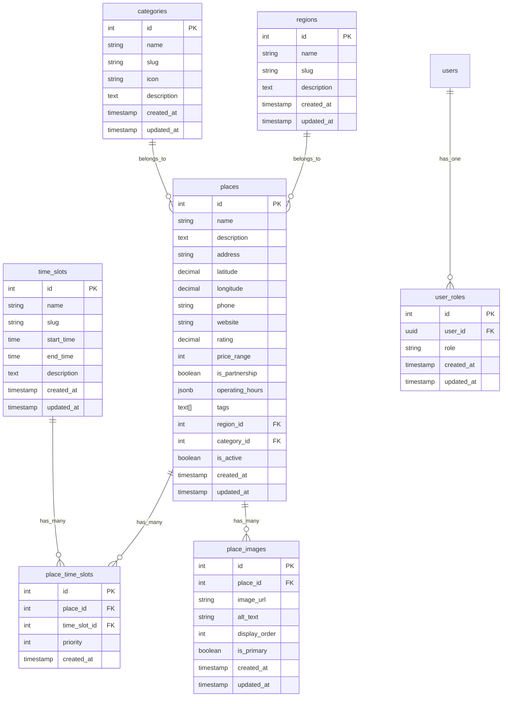

# 코스모스 - 기술적 개요 및 아키텍처

## 🏗️ 프로젝트 구조

```
course-more-us/
├── app/
│   ├── lib/                    # 서버 사이드 로직
│   │   ├── auth.server.ts      # 인증 관련 함수
│   │   ├── admin.server.ts     # 관리자 권한 및 CRUD
│   │   ├── recommendation.server.ts # 추천 로직
│   │   └── supabase.server.ts  # Supabase 클라이언트
│   ├── routes/                 # 페이지 라우트
│   │   ├── auth/              # 인증 관련 페이지
│   │   │   ├── login.tsx
│   │   │   └── signup.tsx
│   │   ├── admin/             # 관리자 페이지
│   │   │   ├── _index.tsx     # 대시보드
│   │   │   └── places/        # 장소 관리
│   │   ├── _index.tsx         # 메인 페이지
│   │   └── $.tsx              # 404 캐치올
│   ├── types/
│   │   └── database.types.ts   # Supabase 타입 정의
│   └── root.tsx               # 앱 루트
├── supabase/
│   ├── migrations/            # 데이터베이스 마이그레이션
│   ├── schema.sql            # 데이터베이스 스키마
│   ├── seed.sql              # 초기 데이터
│   └── config.toml           # Supabase 설정
└── docs/                     # 프로젝트 문서
```

## 🔧 핵심 기술 스택

### Frontend
- **Remix**: React 기반 풀스택 프레임워크
- **TypeScript**: 타입 안전성 보장
- **Tailwind CSS**: 유틸리티 퍼스트 CSS 프레임워크

### Backend
- **Remix Server Functions**: 서버 사이드 로직
- **Supabase**: BaaS (Backend as a Service)
  - PostgreSQL 데이터베이스
  - 실시간 구독
  - 인증 시스템
  - Row Level Security (RLS)

### 개발 도구
- **Supabase CLI**: 로컬 개발 환경
- **Git**: 버전 관리
- **VS Code**: 개발 환경

## 📊 데이터베이스 설계

### ERD (Entity Relationship Diagram)



### 주요 테이블 설명

#### `places` (장소)
- **핵심 엔티티**: 모든 추천 대상 장소 정보
- **위치 정보**: `latitude`, `longitude`로 지도 연동 준비
- **메타데이터**: 평점, 가격대, 제휴 여부, 운영시간
- **관계**: 지역, 카테고리와 N:1 관계

#### `place_time_slots` (장소-시간대 연결)
- **다대다 관계**: 장소와 시간대 간의 연결
- **우선순위**: `priority` 필드로 시간대별 추천 순서 결정

#### `user_roles` (사용자 역할)
- **권한 관리**: 관리자/일반 사용자 구분
- **확장성**: 향후 다양한 역할 추가 가능

## 🔐 보안 아키텍처

### Row Level Security (RLS) 정책

```sql
-- 읽기 권한: 모든 사용자
CREATE POLICY "Anyone can read active places" 
ON places FOR SELECT USING (is_active = true);

-- 관리 권한: 인증된 사용자만
CREATE POLICY "Authenticated users can manage places" 
ON places FOR ALL USING (auth.role() = 'authenticated');

-- 사용자 역할: 본인 역할만 조회 가능
CREATE POLICY "Users can read their own role" 
ON user_roles FOR SELECT USING (auth.uid() = user_id);
```

### 인증 플로우

1. **로그인 요청** → Supabase Auth
2. **JWT 토큰 발급** → 쿠키에 저장
3. **서버 사이드 검증** → `requireAuth()` 함수
4. **권한 확인** → `isAdmin()` 함수
5. **RLS 정책 적용** → 데이터 접근 제어

## 🚀 API 설계

### 서버 함수 구조

#### 인증 관련 (`auth.server.ts`)
```typescript
export async function requireAuth(request: Request)
export async function getUser(request: Request)
export async function createSupabaseServerClient(request: Request)
```

#### 관리자 기능 (`admin.server.ts`)
```typescript
export async function requireAdmin(request: Request)
export async function isAdmin(request: Request): Promise<boolean>
export async function getAllPlaces(request: Request)
export async function createPlace(request: Request, data: PlaceInsert)
export async function updatePlace(request: Request, id: number, data: PlaceUpdate)
export async function deletePlace(request: Request, id: number)
```

#### 추천 시스템 (`recommendation.server.ts`)
```typescript
export async function getRegions(request: Request)
export async function getTimeSlots(request: Request)
export async function getRecommendations(request: Request, params: RecommendationParams)
```

### 라우트 구조

#### 공개 라우트
- `/` - 메인 페이지 (로그인 상태에 따라 다른 UI)
- `/auth/login` - 로그인
- `/auth/signup` - 회원가입

#### 보호된 라우트
- `/admin/*` - 관리자 전용 (권한 확인 필요)

## 🎨 UI/UX 설계 원칙

### 디자인 시스템
- **색상**: Purple 계열 (브랜드 컬러)
- **타이포그래피**: 시스템 폰트 스택
- **간격**: Tailwind의 spacing scale 활용
- **반응형**: Mobile-first 접근

### 컴포넌트 패턴
- **카드 레이아웃**: 장소 정보 표시
- **폼 검증**: 실시간 에러 표시
- **로딩 상태**: 사용자 피드백 제공
- **조건부 렌더링**: 권한 기반 UI 표시

## 🔄 데이터 플로우

### 추천 요청 플로우
1. **사용자 입력** (지역, 날짜, 시간대)
2. **폼 검증** (클라이언트 + 서버)
3. **데이터베이스 쿼리** (조건에 맞는 장소 검색)
4. **결과 가공** (평점, 우선순위 정렬)
5. **UI 렌더링** (카드 그리드 표시)

### 관리자 CRUD 플로우
1. **권한 확인** (`requireAdmin`)
2. **데이터 검증** (타입 체크)
3. **데이터베이스 작업** (Supabase 쿼리)
4. **결과 반환** (성공/실패 처리)
5. **UI 업데이트** (리다이렉트 또는 상태 변경)

## 📈 성능 최적화

### 현재 구현된 최적화
- **서버 사이드 렌더링**: Remix의 기본 기능
- **타입 안전성**: TypeScript로 런타임 오류 방지
- **데이터베이스 인덱스**: 주요 쿼리 필드에 인덱스 설정

### 향후 최적화 계획
- **이미지 최적화**: WebP 변환, 지연 로딩
- **쿼리 최적화**: 필요한 필드만 선택
- **캐싱**: Redis 또는 메모리 캐시 도입
- **CDN**: 정적 자산 배포 최적화

## 🧪 테스트 전략

### 현재 상태
- **수동 테스트**: 기능별 시나리오 테스트
- **타입 체크**: TypeScript 컴파일 타임 검증

### 향후 테스트 계획
- **단위 테스트**: 서버 함수 테스트
- **통합 테스트**: API 엔드포인트 테스트
- **E2E 테스트**: 사용자 시나리오 테스트
- **성능 테스트**: 부하 테스트

## 🚀 배포 전략

### 현재 환경
- **개발**: 로컬 Supabase + Remix Dev Server
- **프로덕션**: Supabase Cloud + 배포 플랫폼 미정

### 배포 옵션
1. **Vercel**: Remix 최적화, 자동 배포
2. **Netlify**: JAMstack 친화적
3. **Railway**: 풀스택 앱 배포
4. **Fly.io**: 글로벌 배포

## 📚 개발 가이드라인

### 코딩 컨벤션
- **파일명**: kebab-case (라우트), camelCase (함수)
- **함수명**: 동사로 시작 (`getUser`, `createPlace`)
- **타입명**: PascalCase (`PlaceInsert`, `UserRole`)
- **상수**: UPPER_SNAKE_CASE

### Git 워크플로우
- **브랜치**: `main` (프로덕션), `develop` (개발)
- **커밋**: Conventional Commits 형식
- **PR**: 기능별 단위로 분할

### 에러 핸들링
- **서버 에러**: try-catch로 감싸고 적절한 HTTP 상태 코드 반환
- **클라이언트 에러**: 사용자 친화적 메시지 표시
- **로깅**: 개발 환경에서 console.log, 프로덕션에서 로깅 서비스

---

이 문서는 프로젝트의 기술적 구조와 설계 결정을 설명합니다. 새로운 개발자가 프로젝트에 참여할 때 참고할 수 있는 가이드 역할을 합니다. 